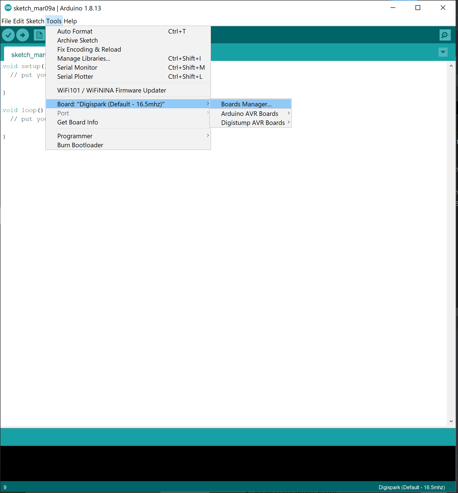

First Page
==========

**Thesis:** Tutorial on building your own USB Rubber Ducky using a Digispark and
    Arduino.

Introduction and Disclaimer
---------------------------

In this tutorial you will be creating a make shift USB Rubber Ducky for only
a few dollars using a Digispark and Arduino IDE. If you are not familiar with
a USB Rubber Ducky, USB Rubber Duckys are a USB device that once inserted into
a computer does a hacking technique called keystroke injection.These USB Rubber
Duckys use scripts called ducky scripts. Hackers around the world have created
many of their own since it is cheaper and fairly easy to make their own USB
Rubber Ducky. Hackers have also been starting to disguise these USBs. They take
the USB and turn it into a fake phone charger or similar USB plugin devices. We
will be creating one of these on our own using the Digispark and Arduino IDE
scripting that is similar to the ducky scripts.

Disclaimer: What you will be creating in this tutorial can be used for criminal
activity. Creating one of these is not illegal, but how you use it can be
illegal. DO NOT use this in any form of criminal activity and DO NOT use one of
these on a computer without permission. If you do happen to get permission you
can or will be held liable if you manage to break their computer. Many scripts
that you can download or create can damage, crash, or even fully destroy a
computer.

Purchase A Couple Digisparks
----------------------------

For this project you will need some Digisparks USBs. You will need the attiny85
You will need more then one so make sure to buy a couple of them or buy them in
bulk. Amazon sells these Digisparks and they are very inexpensive. Once you get
your Digisparks then you are ready to go onto the next step.

Download and Set Up Arduino For The Digispark
---------------------------------------------

Before we can write scripts for the Digispark we need to download Arduino IDE.
You can download Ardunio IDE here : https://www.arduino.cc/en/software . When
the installation is set up, a window will pop up. You can keep all the default
settings for Ardunio IDE. Once it is done downloading, we can then set up
Arduino IDE for the Digispark we want to use.

The first thing we must do to set up Ardunio IDE is download a JSON package that
stores all of the different Digispark boards and their code to run them into
Ardunio IDE. First you will need to go to **File** then **Preferences**. Once in
**Preferences** make sure you are in the **Settings** tab. Look for
**Addition Board Manager URLs:** and copy and paste this URL into that field:
http://digistump.com/package_digistump_index.json then click ok. If you need
more space, then click the button next to the field and a window should open
where you can add the URL.

.. image:: ../images/boards_manager.png
   :width: 500
   :alt: board_manager

Once the URL has been added to Ardunio IDE we can then set up the selection of
which Digispark we want to use and write our scripts for it. To select our
Digispark go to **Tools**, hover over **Board:**, go to **Boards Manager**,
and in the search bar type in “digispark”. You should see a package that says
**Digispark AVR Boards by Digistump**. Click **Install** in the bottom right
corner and let it download.

Once the package has been installed, we can now select which Digispark we want
to use. We will be selecting the default Digispark. To do this go to **Tools**,
hover over **Board:**, hover over **Digistump AVR Boards**, and select
**Digispark (Default – 16.5mhz)**. Once you have selected the correct
Digispark you are ready to start writing scripts or even downloading scripts
made by others on the internet. [#f4]_

.. image:: ../images/digispark_default.png
   :width: 500
   :alt: default_digispark

Create Our Script
-----------------

We are ready to write our own script for our Digispark. At the very top of the
script type int **#include "DigiKeyboard.h"**. It should be above the void setup
section.

Now we don't need to put anything in for void setup(), I will explain why later.
In the void loop() type **DigiKeyboard.sendKeyStroke(0);** then hit enter. The
next line of code we want to type in is **DigiKeyboard.println("Hello Digispark!");**
once you are done hit enter one more time. The last part of the code you need to
type is **DigiKeyboard.delay(5000);**. Your code should know look like this:

Before downloading this onto your Digispark, you must understand what the code
is doing and what sendKeyStroke, println, delay, void setup, and void loop means.
For sendKeyStroke you are sending to the computer what button to press on the
keyboard. In this case we are sending zero because we want to prevent any
missing characters that are entered in since some older devices can cause
problems. This isn't necessary, but its better to be safe for now. Println means
that it will print something on new lines, so for this it will print Hello
Digispark! on separate lines. Delay is how long the code will wait before
doing the next action or line of code. The time is in milliseconds, so the code
is waiting 5 seconds before doing the loop again. For void setup, any code that
is put in its curly brackets are ran in the beginning of the execution and
never ran again. For void loop, any code that are in its curly brackets is ran
multiple times or ran nonstop.

So what is this script doing? The script is actually very simple and all it is
doing is printing Hello Digispark! on separate lines multiple times in Arduino.

Download The Script We Made Onto The Digispark
----------------------------------------------

Now its time to download our script we created. First we need to compile the
code. To do this click the check mark in the top left corner. To do this click
the green arrow up in the top left corner of Arduino IDE. You will have 60
seconds to insert your Digispark into your computer.

.. image:: ../images/arrow.png
   :width: 500
   :alt: arrow

Once it is inserted it will begin to download. Once it is done it is ready to be
inserted into a computer and you should see "Hello World" being printed. When
you do insert the Digispark into a computer the Digispark will have a 5 second
delay before it will execute the script due to the lack of hardware parts the
Digispark has for USB communication and lack of resources.

Using Pre-Made Script
---------------------

Now that you created your own lets do a pre-made one. There are so many that are
pre-made on the internet but we will use the RickRoll_Update script from
CedArctic's GitHub repo. You can find the GitHub link here: https://github.com/CedArctic/DigiSpark-Scripts

Once on the github repository find the RickRoll_Update folder and click the file
that has the code. Below is an image of what the code looks like. Now copy and
paste the code into Arduino IDE.

Now before we download the script onto the Digispark we need to understand what
this script is doing. This script will essentially bring up the GUI for
searching on windows, paste in the youtube url link, and then hit enter. Then it
will bring you or your victim to the sweet song of Rick Astley - Never Gonna
Give You Up. This is known as the RickRoll which is the title of the script we
are using.

The next thing to understand is again the KEY, GUI, print, for(). KEY is what
keyboard button is going to be pressed, so in this case the first key that will
be pressed is R. MOD_GUI_LEFT stands for the windows key button in the bottom
left corner of the keyboard. Print is what is going to be printed into or onto
whatever we want, so we are printing the url into the search. Lastly, the for()
is similar to the void loop but since it is empty it will end the loop. We
wouldn't want to have this ran multiple times continuously, or maybe you do, that
is up to you. If you didn't have th for loop it would make and endless amount of
RickRolls which could make your computer freeze and/or crash.

Now that you know what the code is doing and have it all set up, it is time to
download it on the Digispark.

Download The Pre-Made Script Onto The Digispark
----------------------------------------------

Lets downlad this script onto the Digispark. You can use the Digispark used when
we created our own script if you want. When you download a new script onto a
Digispark that has a script on it, the script that is currently on it will be
erased. First, click the check mark in the top left corner and compile the code.
To download after it is done compiling, click the green arrow in the top left
corner of Arduino IDE. You will have 60 seconds to insert the Digispark into the
computer.

.. image:: ../images/arrow.png
   :width: 500
   :alt: arrow

Once it is done you are ready to to insert it into a computer. Remember, since
the Digispark is missing a bunch of hardware parts that help with USB
communication and has limited resources it has about a five second delay before
the script is ran.

Conclusion
----------

In this tutorial, we created a USB Rubber Ducky with only a few dollars using
a Digispark and Arduino IDE. We created our own script and downloaded a script
using Arduino IDE then downloaded them onto the Digispark. What we
created was a device that uses a hacking technique called keystroke injection.
There is still so much you can do with these little device and so many scripts
you can download or create yourself and we just scratched the surface.

.. [#f4] Kody. (2019, December 13). *How to Run USB Rubber Ducky Scripts on a
   Super Inexpensive Digispark Board*. WonderHowTo.
   https://null-byte.wonderhowto.com/how-to/run-usb-rubber-ducky-scripts-super-inexpensive-digispark-board-0198484/.

.. [#f5] CedArctic. (2020, July 31). *DigiSpark-Scripts*. GitHub.
    https://github.com/CedArctic/DigiSpark-Scripts

.. [#f6] *Writing your first USB rubber Ducky Payload*.
    https://docs.hak5.org/hc/en-us/articles/360010471234-Writing-your-first-USB-Rubber-Ducky-Payload.
